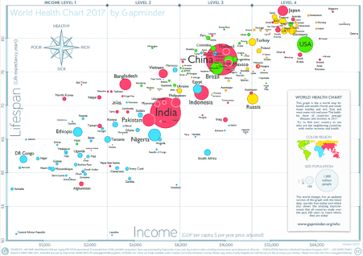

## The Beauty of Data Visualization

David McCandless, a British data-journalist, curates a visually striking collection of graphs, charts, and maps covering diverse topics like science, food, dogs, and countries on his blog, "Information is Beautiful" (McCandless 2018).

 
One particularly intriguing creation, "International Number Ones: Because every country is good at something" (McCandless 2016), showcases unique achievements of each country according to data. Notably, the visualizations on this website are regularly refreshed and refined as new data becomes accessible.

 
<figure markdown="span">
  { width="600" }
  <figcaption>Country Visualization</figcaption>
</figure>

## Data Visualization

Data visualization is a powerful tool that translates complex data into easily understandable and insightful visuals. It goes beyond just presenting numbers and figures; it transforms raw data into graphical representations that can uncover trends, correlations, and anomalies that might otherwise remain hidden.

 
The primary aim of data visualization is to convey information in a clear and efficient manner using visual elements. It's important to note that effective data visualization doesn't have to sacrifice aesthetics for functionality or complexity for beauty. To effectively convey ideas, both visual appeal and practicality must work together, simplifying the understanding of complex and sparse data sets by presenting their essential aspects in an intuitive manner.

 
For example, imagine you have a dataset containing monthly sales figures for a retail store over the past year. Instead of looking at a long list of numbers, you can create a line chart that shows the sales trends over time. By visualizing the data in this way, you can quickly spot whether sales are increasing, decreasing, or remaining stable. This visual representation makes it much easier to grasp the overall sales performance and identify specific months where there might have been a spike or a dip in sales.

 
Data visualization isn't limited to simple charts and graphs; it can also involve more complex visualizations like heatmaps, scatter plots, and geographic maps. These visualizations can reveal intricate patterns and relationships within data, aiding in data exploration and decision-making (Friedman 2008).

### Static vs. Interactive Data Visualization

Data visualization can be static, like the charts and maps mentioned above, or interactive. Interactive visualizations allow users to explore the data further. For example, an interactive pie chart might allow users to click on a slice and see a breakdown of the specific expenses within that department.

## Making Sense of Data
Data visualization is a powerful tool for transforming raw data  -  numbers, percentages, and text -  into clear and understandable visuals. Let's delve deeper into this concept with examples to see how it aids comprehension.

### Tabular Data vs. Visual Charts

#### Using Tabular Data

Tabular data refers to information organized in a table with rows and columns. This format is useful for precise, detailed data analysis, such as calculating exact quantities and performing specific comparisons.

 
**Example**: Consider a table showing monthly sales data for various products:

| Month    | Product A | Product B | Product C | Product D | Product E |
| -------- | --------- | --------- | --------- | --------- | --------- |
| January  | 500       | 450       | 300       | 200       | 250       |
| February | 467       | 490       | 300       | 250       | 240       |
| March    | 520       | 430       | 310       | 300       | 280       |
| April    | 480       | 470       | 315       | 320       | 270       |
| May      | 510       | 450       | 305       | 350       | 290       |

- **Calculating Changes**: Tabular data allows for precise calculations. For example, to calculate the percentage drop in sales of Product A from January to February:
  - **Formula**: \( \text{Percentage Drop} = 1 - \frac{\text{Sales in February}}{\text{Sales in January}} \)
  - **Calculation**: \( 1 - \frac{467}{500} = 1 - 0.934 = 0.066 \) or 6.7%

While tabular data provides exact figures and facilitates specific computations, it has limitations in presenting a comprehensive view of the data and identifying broader trends or patterns.

#### Using Visual Charts

Visual charts are graphical representations of data that help in identifying trends, comparing different data sets, and recognizing patterns and anomalies more effectively than tables. 

 
**A set of visual charts for the same sales data could include:**

 
**Bar Chart**: Comparing overall sales of different products.

 
   { width="600" }

     - Insights: 
       - Product A: Total sales are higher compared to other products.
       - Product B: Close in sales to Product A but with noticeable variations across months.
       - Product C: Consistently has the least total sales.
       - Product D: Shows a steady increase in sales over the months.
       - Product E: Has moderate sales but with a notable dip in one of the months.

 
**Line Chart**: Showing sales trends over time for each product.
 
 {width="600"}

     - Insights: 
       - Sales of Product D are increasing steadily.
       - Sales of Product C are relatively stable.
       - Sales of Product B fluctuate more over time.
       - Product E's sales fell considerably in September.

### Data Visualization to the Rescue

Here's where data visualization comes in! By converting this raw data into a chart, for example a bar chart, we can see the information in a new light. The x-axis could represent different colors, styles, or sizes, and the y-axis could represent the number of people who prefer each option. The bars would then visually depict which options are more popular. This makes it instantly clear which colors and styles resonate most with customers.

## The Purpose of Data Visualization

Data visualization is a critical tool in the modern data-driven world. It serves multiple purposes that are essential for individuals and organizations looking to make sense of complex data and derive meaningful insights. Here are the detailed purposes of data visualization:

### Help Thinking

Data visualization plays a crucial role in the cognitive process of understanding and analyzing data by reducing cognitive load and enhancing pattern recognition. By transforming complex datasets into visual formats like charts, graphs, and maps, it simplifies the mental effort needed to comprehend the information, allowing for quicker and more accurate critical thinking. Visual tools facilitate comparative analysis, making it easy to identify relationships, anomalies, and trends, which might be missed in raw numerical data. This capability is particularly useful in business performance analysis, market research, and healthcare data analysis, where quick insights can drive strategic decisions.

 
Moreover, data visualization improves data storytelling and memory retention, making complex information more engaging and easier to recall. By providing a clear and compelling narrative around data, visualizations help stakeholders understand and remember key insights, leading to more effective communication and better-informed decisions. Additionally, interactive dashboards and visual tools enable deeper exploration and insight generation, uncovering hidden trends and relationships that inform actionable strategies. Overall, data visualization is indispensable for making sense of large quantities of data, supporting better decision-making and fostering creativity and innovation.

 
**Example**:
Consider a manager trying to understand employee performance metrics. A heat map showing productivity levels across different departments can quickly highlight areas of high and low performance, helping the manager think about resource allocation and training needs without getting bogged down by numbers in a spreadsheet.

### Answer a Question

One of the primary purposes of data visualization is to provide clear and concise answers to specific questions by transforming complex datasets into easily understandable visual formats. This clarity allows users to quickly see the results and outcomes of their data queries, facilitating faster and more accurate decision-making. For instance, a bar chart comparing sales figures across different regions can immediately reveal which region is performing the best without needing to sift through rows of numerical data. Similarly, a line graph showing revenue trends over time can quickly indicate whether a company's financial performance is improving or declining, helping managers make timely strategic adjustments.

 
Visual tools not only present data in a digestible manner but also enhance the ability to draw meaningful conclusions. By highlighting key insights and patterns, data visualizations make it easier to understand relationships and trends within the data. For example, a heat map displaying customer satisfaction scores across various product lines can instantly show which products are well-received and which need improvement. This immediate visibility into critical data points aids in making informed decisions, ensuring that actions are based on solid evidence rather than assumptions. Ultimately, data visualization serves as a powerful means to answer specific questions clearly and concisely, driving better outcomes across various domains.

 
**Example**:
A marketing team wants to know which social media platform generates the most leads. A bar chart comparing leads generated from different platforms (e.g., Facebook, Twitter, LinkedIn) can instantly answer this question by highlighting the top-performing platform.

### Uncover Patterns

Data visualization is instrumental in uncovering hidden patterns and trends that may not be immediately apparent in raw data. By converting vast and complex datasets into visual representations such as charts, graphs, and heat maps, data visualization makes it easier to spot relationships, trends, and anomalies that would be difficult to detect through traditional data analysis methods. For instance, a scatter plot can reveal a correlation between two variables, such as advertising spend and sales revenue, that might not be obvious when looking at the numbers alone. Similarly, a heat map can highlight areas with higher activity or performance, making it simpler to identify regions or segments that require attention or have potential for growth.

 
Visual tools are particularly effective at uncovering clusters and anomalies within data, leading to deeper insights and more informed decision-making. Clusters in a data set might indicate segments of customers with similar behaviors or preferences, which can be targeted for more effective marketing campaigns. Anomalies, on the other hand, might reveal issues or opportunities that need further investigation, such as an unexpected drop in sales in a particular region or an outlier that could signify a potential breakthrough. By using data visualization to highlight these patterns and deviations, businesses can gain a better understanding of their data, enabling them to respond more strategically to emerging trends and issues. This proactive approach can significantly enhance operational efficiency and competitive advantage.

 
**Example**:
A retailer wants to understand purchasing patterns. A scatter plot showing the relationship between purchase amounts and customer age groups might reveal that younger customers tend to make smaller but more frequent purchases, while older customers make larger purchases less frequently.

### Clarify

Visualizations clarify complex data by distilling it into more understandable and accessible formats, effectively removing ambiguity. When faced with large datasets or intricate information, raw numbers and text can be overwhelming and difficult to interpret. Visual tools such as charts, graphs, and infographics transform this data into visual formats that highlight key points and trends, making the information more straightforward and easier to grasp. For instance, a complex financial report filled with numerous figures and calculations can be simplified into a series of pie charts and bar graphs, which immediately convey the distribution of expenses and revenue streams. This transformation helps individuals quickly understand the core message without getting lost in the details.

 
By presenting data in a clear and concise manner, visualizations enhance comprehension and facilitate better decision-making. They enable users to see the bigger picture and understand the relationships between different data points, which might be missed when the data is presented in a textual or numerical format. For example, a line graph showing monthly sales over a year provides a clear visualization of trends, such as seasonal peaks and troughs, which helps in forecasting and strategic planning. By distilling complex data into visually digestible formats, visualizations ensure that the information is communicated effectively, reducing the risk of misinterpretation and allowing for more informed and confident decisions.

 
**Example**:
A financial analyst needs to explain quarterly performance to stakeholders. A combination of line charts and pie charts can clarify the company's revenue trends and market share distribution, making the data more accessible and understandable to non-experts.

### Encourage Creativity

Data visualization acts as a bridge between raw data and creative insights. Imagine a researcher studying social media trends. They might have mountains of data on user behavior, but this raw format can be overwhelming and difficult to glean insights from.  Data visualization tools transform this data into charts, graphs, or even interactive maps.  Suddenly, hidden patterns and relationships emerge.  For instance, a graph might reveal a correlation between certain hashtags and spikes in user engagement.  This visual representation sparks curiosity and ignites new lines of inquiry.  The researcher might now explore the reasons behind this correlation, leading to innovative social media marketing strategies.

 
Data visualization tools aren't static pictures. Many are interactive, allowing users to manipulate the data in real-time.  Imagine a sales manager analyzing regional sales figures.  With an interactive chart, they can filter data by product category, geographic location, or time period. This ability to explore the data from different angles fosters a "what if" mentality.  The manager can ask questions like "What if we offered a discount on product X in region Y?"  By visualizing the potential outcomes of these hypothetical scenarios, the manager can experiment with new strategies and make data-driven decisions that drive sales growth.

 
**Example**:
A product development team is brainstorming new features. A visualization of customer feedback sentiment over time, represented as a word cloud, can spark creative ideas by highlighting the most commonly mentioned features and issues.

### Communicate

Data visualization shines as a powerful tool for effective communication. Raw data, often presented in spreadsheets or lengthy reports, can be dense and difficult to grasp for many audiences. Numbers and figures can feel abstract and fail to capture the bigger picture. This is where data visualization steps in, acting as a translator that transforms complex data into clear and engaging visuals.

 
Imagine a company trying to present financial data to its investors.  A traditional report filled with numbers and charts might leave some investors confused.  However, by utilizing data visualization, the company can create compelling infographics or interactive dashboards.  These visuals can highlight key financial metrics like revenue growth, profit margins, and market share. Charts and graphs can visually represent trends over time, making it easier to understand the company's financial health. This clear and engaging format fosters better communication with investors, building trust and transparency.  Similarly, data visualization can be used to communicate insights to team members and stakeholders across different departments.  By presenting data visually, everyone can be on the same page, leading to better collaboration and informed decision-making.

 
**Example**:
During a board meeting, a CEO uses an interactive dashboard to present the company's strategic KPIs. The visualizations communicate the company's performance and future projections clearly, enabling informed decision-making and discussions.

### Inspire

Data visualization isn't just about presenting information; it's about inspiring action.  Raw data, even when meticulously analyzed, can sometimes lack the punch needed to truly motivate change.  This is where data visualization steps in, transforming insights and trends into compelling visuals that spark action.

 
Imagine a city planner analyzing traffic congestion data. Spreadsheets filled with numbers might reveal peak traffic hours and accident-prone intersections.  However, this format might not effectively communicate the urgency of the problem.  Data visualization tools can create interactive maps that highlight congested areas with pulsating red zones. Animations can show traffic flow patterns throughout the day.  This visual representation makes the problem of traffic congestion tangible and undeniable.  City planners can then use these visualizations to motivate stakeholders and the public to support the implementation of new traffic management solutions, like improved public transportation or redesigned intersections.  Similarly, data visualization can be used by businesses to motivate employees towards achieving specific goals.  By presenting sales figures or customer satisfaction ratings in engaging charts and graphs, employees can clearly see the impact of their work and be inspired to strive for continuous improvement.  In essence, data visualization serves as a powerful call to action, turning insights into a catalyst for positive change.

 
**Example**:
A non-profit organization visualizes the impact of its programs using before-and-after infographics. These visuals inspire donors by showing tangible results, such as improved literacy rates or reduced poverty levels, encouraging further support and engagement.

## Beyond Clarity: The Benefits of Data Visualization:

Data visualization is the practice of taking data, often large amounts, and presenting it in a way that's easy to understand and interpret. This can involve charts, graphs, maps, and other visual elements.

- **Identifying Patterns and Trends:** Visualizations help us spot trends and patterns in data that might be missed in raw text format. For instance, a line chart might reveal a gradual decline in website traffic over time, prompting an investigation into the cause.
- **Enhanced Communication:** Data visualizations are excellent communication tools. They can present complex information in a way that is easy for everyone to understand, regardless of their technical background. This allows for clear and effective communication of insights gleaned from data.
- **Informed Decision Making:** By seeing data visually, we can make better decisions based on the information available. Visualizations can highlight key points, relationships, and outliers, enabling us to make informed choices.

Data visualization helps managers to become more self-sufficient in analyzing data. With clear visuals, they can readily understand the information without needing to rely on IT professionals to translate raw data into reports. This saves time and fosters a sense of ownership over the data analysis process.

 
Effective data visualizations can be easily shared and discussed among teams. This promotes collaboration and ensures everyone has a clear understanding of the information at hand. This can lead to better communication and more effective teamwork when making choices that impact the organization.

 
In essence, data visualization is a game-changer for understanding and utilizing data effectively. By transforming raw data into clear visuals, we gain valuable insights, improve communication, and ultimately make data-driven decisions.

