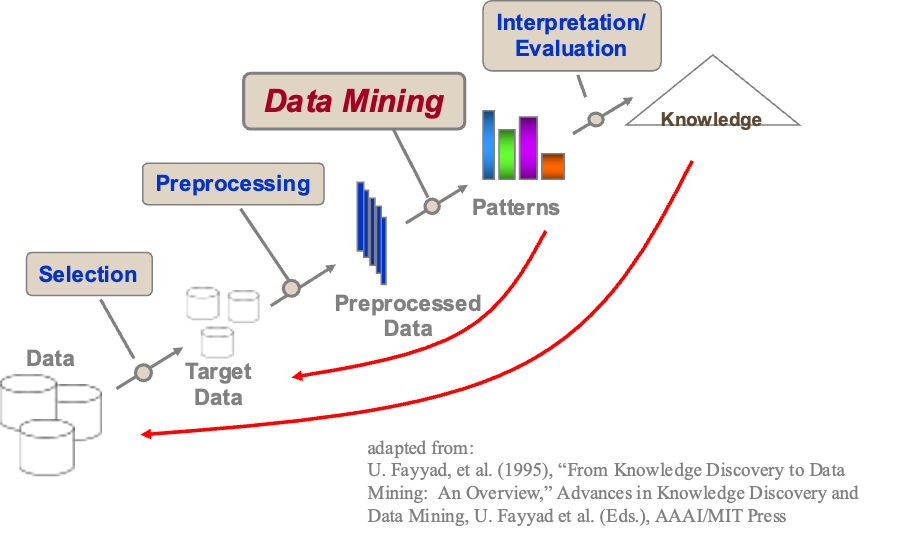

The Knowledge Discovery in Databases (KDD) process is a comprehensive method to extract useful knowledge from large datasets.The goal is to turn raw data into meaningful insights through a structured sequence of steps.

---

## Steps in the KDD Process

 
{Width="800"}

### A. Selection
- **Description:** Identifying and retrieving relevant data from large databases.
- **Example:** Selecting customer transaction records from a retail database for analysis.
- **Process:**
  - Identify data sources.
  - Extract the relevant subset of data.
- **Purpose:** To focus on data that is pertinent to the analysis objectives.

### B. Preprocessing
- **Description:** Cleaning and transforming the selected data to ensure quality and consistency.
- **Example:** Handling missing values and correcting data inconsistencies in customer transaction records.
- **Process:**
  - Data cleaning (e.g., handling missing values, removing duplicates).
  - Data transformation (e.g., normalization, aggregation).
- **Purpose:** To prepare data for analysis by eliminating noise and errors.

### C. Data Mining
- **Description:** Applying algorithms to discover patterns, relationships, or insights within the preprocessed data.
- **Example:** Using association rule mining to find frequent itemsets in retail transactions.
- **Process:**
  - Select appropriate data mining techniques (e.g., classification, clustering).
  - Apply the techniques to extract patterns.
- **Purpose:** To uncover hidden patterns and relationships in the data.

### D. Interpretation/Evaluation
- **Description:** Analyzing the patterns discovered during data mining to determine their significance and usefulness.
- **Example:** Evaluating the business implications of frequent itemsets discovered in retail data.
- **Process:**
  - Interpret the results in the context of the business or research question.
  - Validate the findings using statistical or domain-specific criteria.
- **Purpose:** To assess the value of the discovered knowledge and ensure it is actionable.

### E. Knowledge
- **Description:** Consolidating the evaluated insights into useful knowledge that can inform decision-making.
- **Example:** Implementing promotional strategies based on identified shopping patterns.
- **Process:**
  - Document the insights and patterns.
  - Use the knowledge to make informed decisions or predictions.
- **Purpose:** To apply the discovered knowledge to achieve practical benefits.

## The Scope of Data Mining

The term _data mining_ draws an analogy to the process of extracting valuable business insights from extensive databases, akin to mining for precious ore within a mountain. Both endeavours share the commonality of needing to navigate through vast volumes of material, whether by sifting through it systematically or by intelligently probing to pinpoint areas of value. When dealing with databases of substantial size and quality, data mining technology offers a range of capabilities that can catalyse new business opportunities, including:

- **Automated Prediction of Trends and Behaviours:** Data mining serves as an automated means of uncovering predictive information within large databases. Questions that previously demanded extensive manual analysis can now be swiftly addressed directly from the data itself. A quintessential example of a predictive challenge lies in targeted marketing. Data mining harnesses historical data from past promotional mailings to identify the individuals most likely to yield the highest return on investment in future campaigns. Other predictive tasks encompass forecasting bankruptcy or default rates and discerning segments within a population prone to exhibiting similar responses to specific events.

- **Automated Discovery of Previously Unknown Patterns:** Data mining tools traverse databases in search of concealed patterns, unveiling them in a single comprehensive step. For instance, pattern discovery can be observed in the analysis of retail sales data, where seemingly unrelated products that are frequently purchased together are identified. Additional pattern discovery applications extend to the detection of fraudulent credit card transactions and the recognition of anomalous data points that may signify data entry errors.

In essence, data mining is akin to the astute exploration of a data-rich terrain, unearthing valuable insights and patterns that were previously hidden beneath the surface, thereby empowering businesses to make informed decisions and discover novel opportunities (Tan 2019).

## Six Phases of Data Mining Process

Using the flexible CRISP-DM phases, data teams can move back and forth between stages as needed. Also, software technologies can do some of these tasks or support them for data mining process.

### Business Understanding

Commencing the process, the data scientist or data miner initially delineates the project's objectives and its scope. This involves close collaboration with business stakeholders to ascertain specific details, which encompass

- Identifying the issues that demand resolution
- Recognizing project constraints or limitations
- Assessing the potential business ramifications of proposed solutions

Subsequently, this information serves as the foundation for delineating data mining objectives and pinpointing the resources indispensable for the pursuit of knowledge discovery

### Data Understanding

Upon comprehending the business challenge at hand, data scientists initiate an initial examination of the data. This process involves collecting data sets from diverse origins, securing necessary access permissions, and crafting a comprehensive data description report. This report encompasses crucial details such as data types, volume, and the hardware and software prerequisites essential for data processing. Once the business greenlights their strategy, they embark on the journey of data exploration and validation. They employ elementary statistical methods to manipulate the data, evaluate its quality, and ultimately select a definitive data set for the ensuing phase

### Data Preparation

This phase consumes the majority of data miners' time as data mining software demands top-notch data quality. Business operations typically accumulate and maintain data for purposes unrelated to mining, necessitating data refinement before it can be employed for modelling. Data preparation encompasses the subsequent procedures

- Clean the data: This involves tasks such as addressing missing data, rectifying data errors, handling default values, and making necessary data corrections
- Integrate the data: This process entails merging two distinct data sets to create the ultimate target data set
- Format the data: This step includes actions like data type conversions or configuring data to align with the specific mining technology in use

###Data Modelling

Data miners feed the refined data into the data mining software and examine the outcomes. In this process, they have the flexibility to select from a variety of data mining techniques and tools. Additionally, they need to devise tests to evaluate the quality of the data mining results. When modelling the data, data scientists have the capacity to

- Train machine learning (ML) models using smaller datasets with known outcomes
- Employ the model to delve deeper into the analysis of unfamiliar datasets
- Fine-tune and adapt the data mining software until the results meet the desired level of satisfaction

### Evaluation

After constructing data mining models to address specific business objectives, data miners shift their focus to evaluating the models. This evaluation phase involves sharing the model outcomes with business analysts and collecting their input. Depending on the feedback received, data miners have the flexibility to refine the model, adapt the initial business objectives, or revisit the data itself. This iterative process of evaluation, feedback, and adjustments is a pivotal element of the knowledge discovery process. It not only ensures that the models align with the evolving business needs but also allows for the discovery of unexpected patterns or opportunities that may enhance decision-making

 
For instance, in the context of a retail company using data mining to optimize marketing strategies, the evaluation phase might reveal that a previously overlooked demographic is responding exceptionally well to a campaign. This newfound insight can lead to a targeted marketing approach and potentially influence the modification of the existing model to incorporate this valuable discovery. Ultimately, this ongoing cycle of assessment and refinement enables data mining efforts to continually provide actionable insights and adapt to the dynamic landscape of business objectives

### Deployment

During the deployment phase of data mining, the organization puts the data-driven insights and models into practical use. Data scientists lead this phase, ensuring seamless integration of the models into existing systems. They also educate stakeholders on the model's functionality and provide ongoing support. Business analysts utilize the deployed models to craft reports, enhance decision-making, and improve business processes. Continuous monitoring and maintenance of the data mining application are essential to uphold its performance and adapt it to changing data and business needs

 
For instance, in the context of an e-commerce company, data scientists integrate a recommendation system into their website and mobile app. Business analysts use this system to provide personalized product recommendations to customers, while data scientists continuously monitor and fine-tune the model for accuracy. This ongoing deployment process ensures that data-driven insights become an integral part of the organization's operations, ultimately enhancing customer experiences and business outcomes (Data Mining: What Is It and Why It’s Important - AWS, 2023)

## Data Quality and Data Mining

&nbsp;  
In the real world, data often exhibits a degree of disorderliness. This disorderliness can stem from a variety of factors, including device malfunctions, errors during data entry, or the amalgamation of data from disparate sources. To attain high-quality results from data mining that are not only actionable but also beneficial, it is imperative to rectify this disorderly data.

Furthermore, data can be extensive both in terms of its size and the number of attributes it encompasses, which can lead to the concealment of significant patterns within its subcomponents. Hence, it is crucial to direct our attention to the pertinent sections of the data, considering both its volume and attributes.

Data preprocessing plays a critical role in data mining and machine learning by ensuring the quality of the data used for analysis. Various factors are employed to assess data quality., including:

- **Incompleteness:**  Missing data in a dataset, resulting from various factors like data entry errors or transmission issues, poses a critical challenge in data preprocessing for data mining and machine learning. To maintain dataset completeness and reliability, preprocessing techniques like imputation are employed. Imputation involves estimating missing values based on available data, ensuring that statistical characteristics are preserved. This step is essential for accurate and meaningful analysis, as it enables data scientists to address missing data effectively and enhance the quality of the dataset for subsequent modeling and insights.
- **Inconsistency:** Inconsistent data, stemming from errors in data entry, integration, or storage, can introduce conflicts and contradictions in a dataset. Data preprocessing techniques, such as data cleaning and data integration, are essential for detecting and resolving these inconsistencies. Data cleaning involves identifying and rectifying errors and standardizing formats, while data integration focuses on harmonizing conflicting data from multiple sources. By employing these techniques, data scientists ensure that the dataset is accurate and consistent, facilitating meaningful analysis and reliable model construction.
- **Noise:** Noise in a dataset, stemming from random or irrelevant data introduced during data collection or entry errors, can obscure meaningful patterns. Data preprocessing techniques like data smoothing and outlier detection are crucial for noise reduction. Data smoothing helps remove unnecessary variations, creating a more stable dataset, while outlier detection identifies and isolates data points significantly deviating from the majority, often erroneous or irrelevant, ensuring dataset integrity. These preprocessing steps result in a cleaner, more reliable dataset, facilitating accurate analysis and modelling.
- **Outliers:** Outliers, which are data points significantly differing from the majority in a dataset, can arise from various sources such as data collection or entry errors. Data preprocessing is instrumental in addressing outliers through techniques like detection and removal. Outlier detection systematically identifies these exceptional data points to prevent distortions in subsequent analyses and models, while outlier removal ensures dataset consistency and robustness. This preprocessing step enhances data quality, rendering it more suitable for accurate and reliable analysis and modelling, as illustrated by the example of an outlier student's exam score influencing the class's average performance analysis.
- **Redundancy**: Redundancy in a dataset denotes the presence of duplicated or overlapping data, often arising from processes like data integration or storage. To enhance dataset efficiency, preprocessing techniques such as data deduplication are employed. Data deduplication systematically identifies and eliminates duplicate data points, ensuring data uniqueness and preventing unnecessary replication. This streamlining process simplifies subsequent analysis and modeling, as exemplified by removing duplicate entries of the same customer in a customer database.
- **Data format:** Data format and structure in a dataset refer to how information is organized, encompassing various formats like text, numbers, or categories. Data preprocessing steps, such as data transformation and normalization, are vital for converting data into a consistent format for analysis. Data transformation involves altering data formats, aggregating or disaggregating, or creating new features, ensuring uniformity in data structure. Normalization scales numerical data to a consistent range, enhancing compatibility for analytical methods and allowing fair comparisons. These preprocessing techniques enable data scientists to work with a standardized dataset, promoting meaningful analysis and modelling, exemplified by converting product prices in various currencies to a common format in a product dataset. (Data Mining Data Attributes and Quality, 2020).

## Forms of Data Preprocessing

Data pre-pocessing encompasses a range of tasks, as elaborated upon in the subsequent sections (_Janeja 2022_).

- **Data Cleaning:** In the realm of network traffic data, issues frequently arise, such as missing data values stemming from dropped packets, temporal fluctuations in traffic, and inherent redundancies in communication data. This initial phase addresses the general tidying up of untidy data, tackling (a) missing data values, (b) noisy data, and (c) data inconsistencies and redundancies.
- **Data Transformation and Integration:** When data originates from multiple sources, it may possess differing resolutions, such as yearly versus daily timestamps, or exhibit varying attribute ranges, sometimes spanning large intervals. In these scenarios, the data requires transformation to enable consistent application of traditional data mining algorithms. Additional integration steps, including mapping the structure and content, must also be performed.
- **Data Reduction:** Data mining proves invaluable when patterns must be extracted from vast datasets, such as Wireshark's network traffic data or source-destination communication graphs. is a process in data mining and data analysis aimed at reducing the volume but producing the same or similar analytical results. It involves techniques and methods to simplify and condense complex datasets while retaining their essential characteristics.

